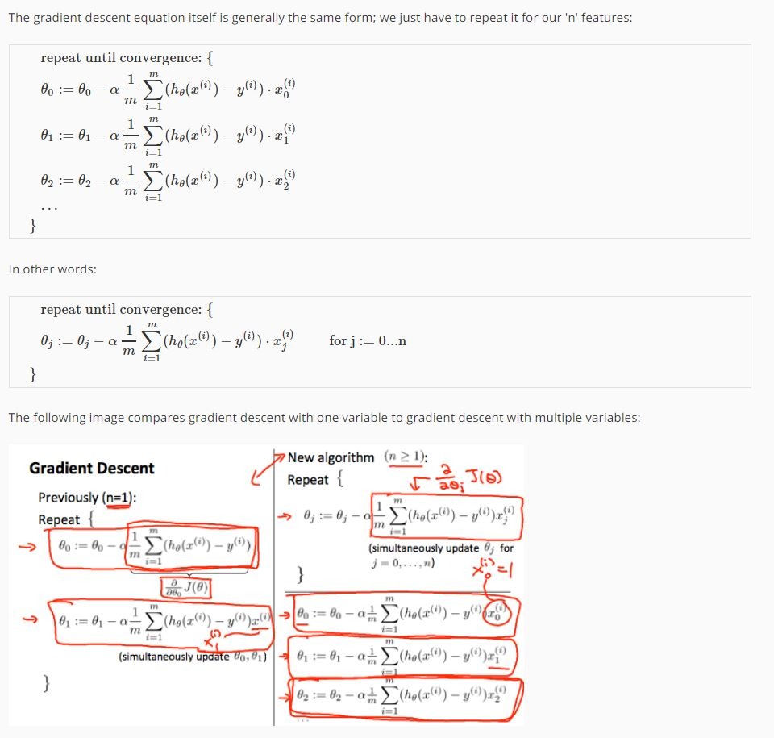
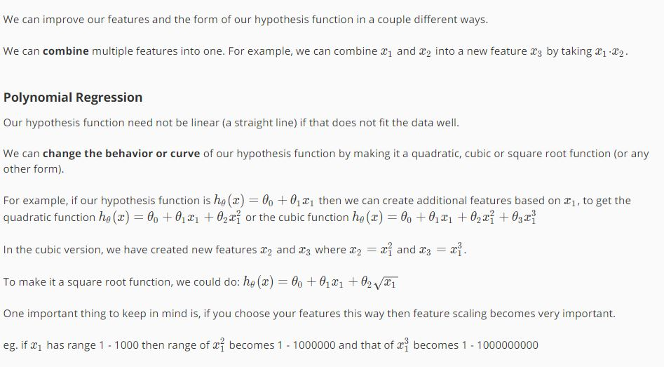

z# Multivariate Linear Regression

## Multiple Features

## Gradien decent for Multi Variables

## Gradient Descent in Pratice - Feature scaling

### Feature Scalling
- https://en.wikipedia.org/wiki/Feature_scaling

## Gradient Descent in Pratice - Learning Rate

## Feature and polynomial Regression

